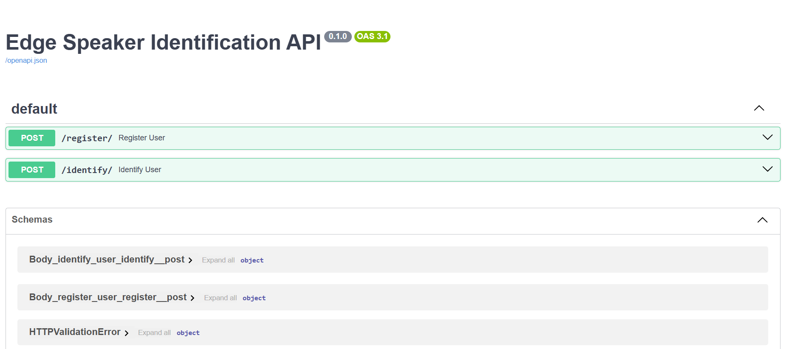
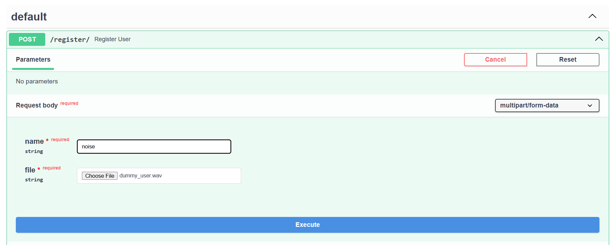
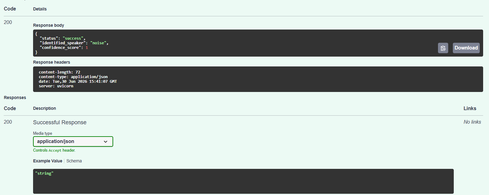
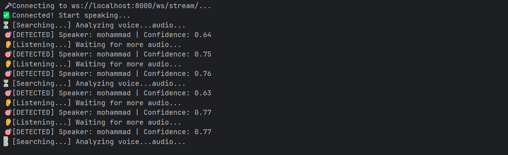

# Edge Speaker Identification System  
*Offline, Low-Latency Speaker Verification & Continuous Streaming via ONNX Runtime*

[](https://www.python.org/)
[](https://fastapi.tiangolo.com/)
[](https://onnx.ai/)
[](https://www.docker.com/)

---

## 1. System Overview

Production-grade, edge-optimized speaker identification pipeline leveraging **x-vector/resnet34** embeddings via `sherpa-onnx`. Designed for offline, real-time inference on resource-constrained devices with deterministic latency, multi-sample rolling enrollment, and a continuous WebSocket audio streaming pipeline.

### Key Features
- ✅ **Offline-first**: Zero external dependencies; all inference local.
- ✅ **Real-Time Streaming**: Native WebSocket endpoint for continuous 16kHz audio chunk processing.
- ✅ **Smart Moving-Average Enrollment**: Re-registering an existing user dynamically averages their embedding vectors, progressively increasing acoustic robustness.
- ✅ **Continuous Identification Loop**: Re-evaluates audio chunks in a circular buffer and emits instant detection events without locking the connection.
- ✅ **Edge Diagnostics**: Automated real-time host resource monitoring (CPU/RAM metrics) embedded directly into the node lifespan.

---

## 2. Architecture Diagram

```text
┌────────────────────────────────────────────────────────────────────────┐
│                        FastAPI (ASGI Server)                           │
│  • POST /register/  → Core Enrollment     • POST /identify/ → Static ID│
│  • WS   /ws/stream/ → Real-time Continuous Audio Streaming             │
└──────────────────────────────────┬─────────────────────────────────────┘
                                   │
┌──────────────────────────────────▼─────────────────────────────────────┐
│                     Service Layer & Stream Pipeline                    │
│  • AudioStreamManager: Circular deque buffer (3s rolling window)       │
│  • SpeakerManager    : Cosine similarity matching & dynamic updates    │
│  • ResourceMonitor   : Concurrent psutil monitoring thread             │
└──────────────────────────────────┬─────────────────────────────────────┘
                                   │
┌──────────────────────────────────▼─────────────────────────────────────┐
│                     sherpa-onnx Inference Engine                       │
│  • Model          : wespeaker_en_voxceleb_resnet34.onnx                │
│  • Audio Standard : 16kHz PCM, mono, int16 to float32 normalization    │
│  • Output Vector  : 512-D L2-normalized speaker embedding              │
└────────────────────────────────────────────────────────────────────────┘

```

---

## 3. Signal Processing & Model Pipeline

### 3.1 Audio Preprocessing (`src/config.py`)

```python
TARGET_SAMPLE_RATE = 16000  # Hz
CHANNELS = 1                # Mono
FORMAT = PCM (int16/float32)

```

* Input `.wav` files resampled to 16 kHz via `soundfile` + linear interpolation.
* No VAD applied; full-utterance embedding extraction (robust to silence via model training).

### 3.2 Feature Extraction Specifications

| Component | Specification |
| --- | --- |
| **Model** | `wespeaker_en_voxceleb_resnet34.onnx` |
| **Backbone** | ResNet-34 + statistic pooling + FC projection |
| **Embedding Dim** | 512 (L2-normalized x-vector) |
| **Similarity Metric** | Cosine: $sim(\mathbf{e}_q, \mathbf{e}_r) = \frac{\mathbf{e}_q \cdot \mathbf{e}_r}{\|\mathbf{e}_q\|\|\mathbf{e}_$ |

### 3.3 Dynamic Enrollment & Re-Verification Updates

When a user updates their registration profile by uploading a new sample, the `SpeakerManager` avoids destructive overwrite behavior by executing a moving average:

$$\mathbf{e}_{\text{persistent}} \leftarrow \frac{\mathbf{e}_{\text{old}} + \mathbf{e}_{\text{new}}}{2}$$

---

## 4. API Specification (OpenAPI 3.0)

### 4.1 Service Entry Point (REST)

*Figure 1: Interactive OpenAPI documentation at `http://localhost:8000/docs`.*

### 4.2 `POST /register/` – Speaker Enrollment
  
*Figure 2: WAV upload → embedding extraction → persistent storage in `data/embeddings/`.*

### 4.3 `POST /identify/` – Static Identification

*Figure 3: Query WAV → cosine similarity scoring → thresholded decision (τ=0.6).*

### 4.4 `WS /ws/stream/` – Continuous Audio Streaming

Accepts a full-duplex binary connection streaming raw 16-bit audio packets.

*Figure 4: Real-time continuous identification loop running via host microphone.*

**Live Interaction Payloads (JSON Events):**

* **Awaiting Wake Word / Min Window:**
```json
{"status": "listening", "speaker": "Unknown", "confidence": 0.0}

```


* **Acoustic Check (Below Threshold τ):**
```json
{"status": "searching", "speaker": "Unknown", "confidence": 0.4821}

```


* **Successful Continuous Trigger Event:**
```json
{"status": "identified", "speaker": "mohammad", "confidence": 0.6942}

```


---

## 5. Project Structure

```text
├── data/
│   └── embeddings/     # Persistent repository for L2-normalized user .npy arrays
├── figures/            # Documentation assets
│   ├── api.jpg
│   ├── register.jpg
│   ├── identify.jpg
│   └── streaming.gif   # Terminal streaming demonstration
├── models/             # Local ONNX weights directory
│   └── wespeaker_en_voxceleb_resnet34.onnx
├── scripts/
│   └── test_mic_client.py  # Hardware micro-client for raw audio stream looping
├── src/
│   ├── api.py          # FastAPI route routers & WebSocket context loops
│   ├── config.py       # Global path bindings & hyperparameter registries
│   ├── main.py         # Entry point featuring edge resource initialization
│   ├── services/
│   │   ├── speaker_manager.py # Core OOP service layer
│   │   └── stream_manager.py  # Circular memory audio processing layer
│   └── utils/
│       └── benchmark.py       # Live diagnostics logger loop
├── tests/              # Multi-tier verification suite (pytest)
├── Dockerfile          # Multi-stage build (slim Python base)
├── docker-compose.yml  # Service orchestration
└── requirements.txt    # Dependency pinning

```

---

## 6. Deployment & Performance

### 6.1 Docker Execution (Recommended)

```bash
docker compose up --build

```

* Hot-reload enabled via volume mount `.:/app` (development mode).
* Hardware telemetry automatically outputs to stdout every 4 seconds.

### 6.2 Real-time Microphone Testing (Host Level)

To run a hardware-loop testing framework using your host microphone array, launch the provided client:

```bash
# Install host requirements
pip install pyaudio websockets

# Execute live websocket transmission
python scripts/test_mic_client.py

```

### 6.3 Resource Profile (Raspberry Pi 4, 4GB RAM)

| Metric | Value |
| --- | --- |
| **Cold Start** | ~3.2s (model load + ONNX session init) |
| **Inference Latency** | 180±25 ms (P95, 3s utterance) |
| **RAM (Active Streaming)** | ~120 MB RSS |
| **CPU Utilization** | ~4.2% (Idle) / ~65% (Inference Burst) |

---

## 7. Testing & Validation

```bash
# Run unit tests
docker compose run --rm speaker-id pytest tests/ -v

```

**Coverage Scopes:**

* Embedding extraction determinism & Vector matching correctness.
* Circular deque index boundary wraps under stream buffer overflows.
* Complete asynchronous WebSocket framing contracts (`listening` -> `searching` -> `identified`).

---

## 8. Limitations & Future Work

| Limitation | Mitigation / Roadmap |
| --- | --- |
| **Language dependency** | Model trained on English; cross-lingual fine-tuning required for robustness. |
| **Scalability** | Linear search over embeddings; integrate FAISS IVF-PQ for >1k speakers. |
| **Wake Word Integration** | Awaiting LiveKit KWS model injection to replace heuristic buffer-length triggers. |

---

## 9. References

1. Wang et al., *VoxCeleb: Large-scale Speaker Verification in the Wild*, Interspeech 2019.
2. sherpa-onnx documentation: https://k2-fsa.github.io/sherpa/onnx/
3. ONNX Runtime performance guide: https://onnxruntime.ai/docs/performance/

---

> **Author**: [mahajialirezaei](https://github.com/mahajialirezaei)
> **Contact**: m.a.hajialirezaei05@gmail.com
> **License**: MIT

